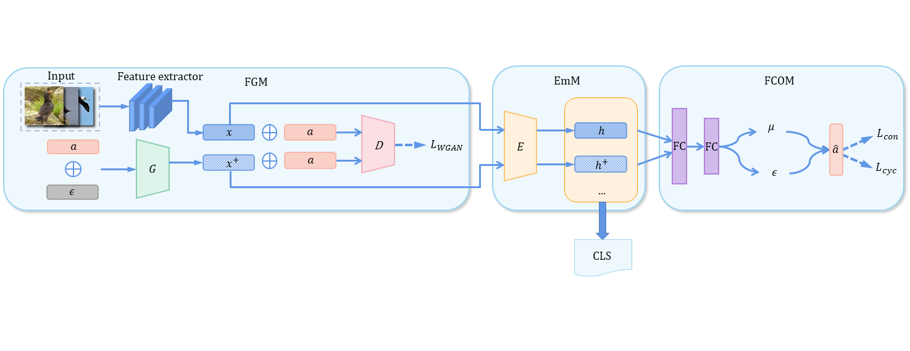

# Co-GZSL

## Co-GZSL: Feature Contrastive Optimization for Generalized Zero-Shot Learning

### Dependencies
This codes requires the following:
- Python 3.6
- Pytorch 1.2.0
- scikit-learn
- pyyaml

### Datasets

Download the dataset (AWA1/AWA2/CUB/FLO) from the work of [Xian et al. (CVPR2017)](http://datasets.d2.mpi-inf.mpg.de/xian/xlsa17.zip), and save correspongding data into directory `./data/`.

### Train and Test

Run Co-GZSL.py:

Set parameter values in './Co_para/{dataset}_4w_2s.yaml'

Modify training dataset in Co-GZSL.py
